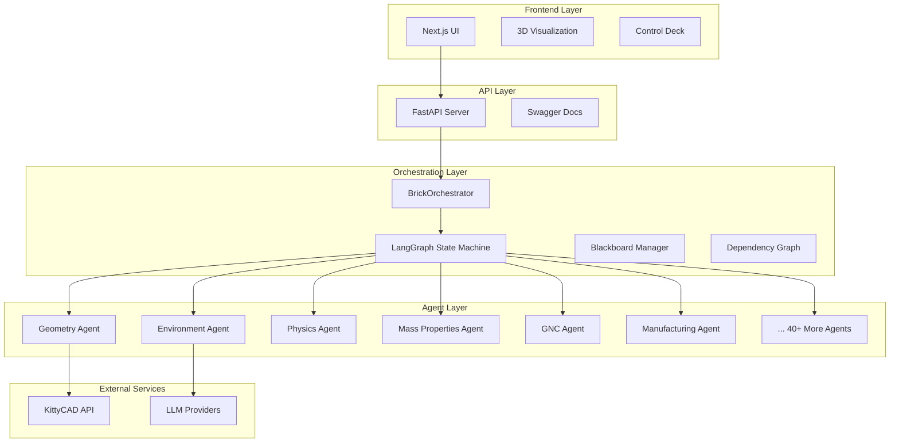
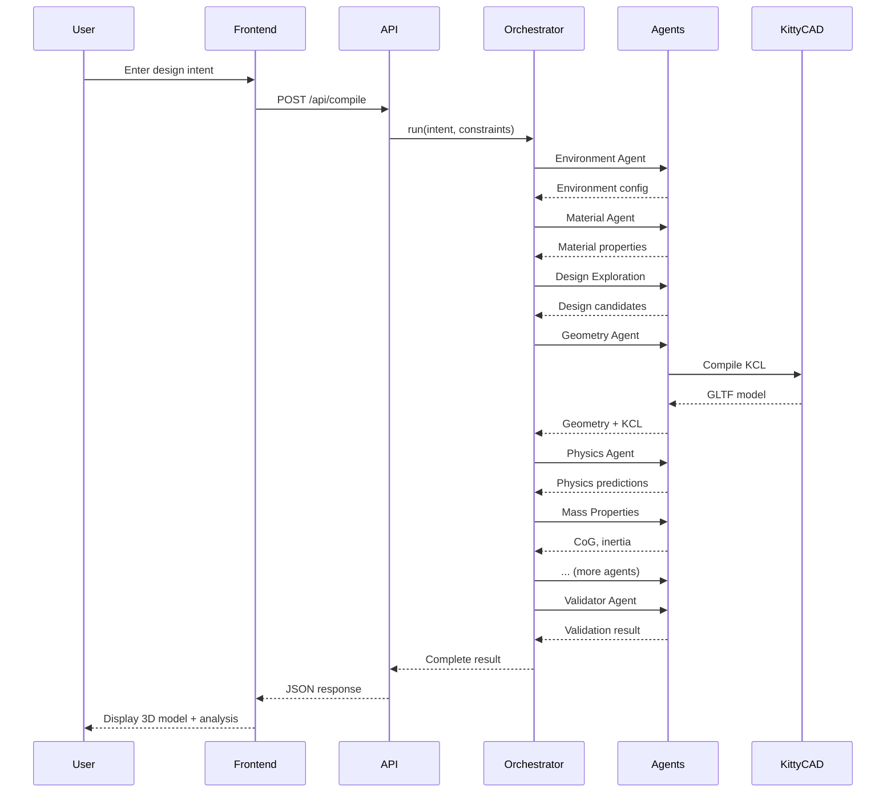
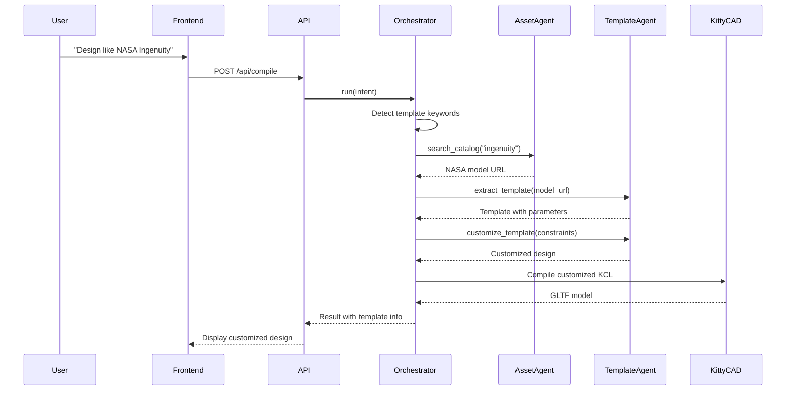

# BRICK OS - Comprehensive System Documentation

> **BRICK OS**: Multi-Agent Hardware Compiler for Intelligent Design Automation

---

## Table of Contents

1. [System Overview](#system-overview)
2. [Architecture](#architecture)
3. [Backend Components](#backend-components)
4. [Frontend Components](#frontend-components)
5. [Agent System](#agent-system)
6. [Workflows & Interactions](#workflows--interactions)
7. [API Endpoints](#api-endpoints)
8. [Environment & Deployment](#environment--deployment)
9. [Data Flow](#data-flow)
10. [Future Roadmap](#future-roadmap)

---

## System Overview

### What is BRICK OS?

BRICK OS is an **intelligent hardware compiler** that transforms natural language design intent into manufacturable hardware designs. It uses a multi-agent system orchestrated by LangGraph to coordinate specialized AI agents across different engineering domains.

### Core Capabilities

- **Natural Language to CAD**: Convert design descriptions to 3D models
- **Multi-Environment Support**: Design for AERO, MARINE, GROUND, SPACE, UNDERSEA environments
- **Physics-Aware Design**: Real-time physics predictions and validation
- **Manufacturing Intelligence**: DfM analysis, BOM generation, and cost estimation
- **Cyber-Physical Systems**: GNC analysis, control system design
- **Material Intelligence**: Temperature-dependent properties and failure prediction
- **Template-Based Design**: Leverage existing designs (NASA Ingenuity, ISS, etc.)

### Technology Stack

**Backend:**
- Python 3.x
- FastAPI (REST API)
- LangGraph (Agent Orchestration)
- NetworkX (Dependency Graph)
- Pydantic (Data Validation)
- KittyCAD API (3D Geometry Generation)

**Frontend:**
- Next.js 14 (React Framework)
- TypeScript
- TailwindCSS
- Three.js (3D Visualization)
- React Three Fiber

---

## Architecture

### High-Level Architecture



### Orchestration Flow

The system uses a **LangGraph state machine** to coordinate agents in a specific workflow:

```mermaid
graph LR
    Start([User Intent]) --> Env[Environment Agent]
    Env --> Template{Template?}
    Template -->|Yes| Search[Template Search]
    Template -->|No| Material[Material Agent]
    Search --> Customize[Template Customize]
    Material --> Explore[Design Exploration]
    Customize --> Geo[Geometry Agent]
    Explore --> Geo
    Geo --> Physics[Physics Agent]
    Physics --> Mass[Mass Properties]
    Mass --> Electronics[Electronics Agent]
    Electronics --> Thermal[Thermal Agent]
    Thermal --> Topo[Topological Agent]
    Topo --> Branch{Design Type?}
    Branch -->|Kinetic| Manifold[Manifold Agent]
    Branch -->|Architectural| Structural[Structural Agent]
    Manifold --> DfM[DfM Agent]
    Structural --> MEP[MEP Agent]
    DfM --> Components[Component Agent]
    MEP --> Zoning[Zoning Agent]
    Components --> Chemistry[Chemistry Agent]
    Zoning --> Design[Designer Agent]
    Chemistry --> CPS[CPS Agent]
    CPS --> GNC[GNC Agent]
    GNC --> Mitigation[Mitigation Agent]
    Mitigation --> Design
    Design --> BOM[BOM/Manufacturing]
    BOM --> Validator[Validator Agent]
    Validator --> Doc[Documentation Agent]
    Doc --> End([Complete])
```



---

## Backend Components

### Core Modules

#### 1. Orchestrator (`orchestrator.py`)

**Purpose**: Coordinates all agents using LangGraph state machine

**Key Responsibilities:**
- Build and execute agent workflow graph
- Manage state transitions between agents
- Handle conditional routing (kinetic vs architectural paths)
- Coordinate dependency graph updates
- Resolve conflicts between agent outputs

**Key Methods:**
```python
async def run(user_intent, project_id, constraints, material, temperature, fit_classes)
def _build_graph() -> StateGraph
def _decide_pod_path(state) -> Literal["kinetic", "architectural"]
```

#### 2. Blackboard Manager (`blackboard.py`)

**Purpose**: Centralized state management for agent communication

**Features:**
- Shared state across all agents
- Thread-safe state updates
- State history tracking
- Conflict detection

#### 3. Dependency Graph (`dependency_graph.py`)

**Purpose**: Track parameter dependencies and enable reactive updates

**Features:**
- NetworkX-based DAG for parameter relationships
- Automatic invalidation of dependent parameters
- Topological sort for execution order
- Default dependency graph with common parameters

**Key Methods:**
```python
def update_parameter(param_name, value) -> List[str]  # Returns invalidated params
def get_execution_order() -> List[str]
def create_default_dependency_graph() -> DependencyGraph
```

#### 4. Conflict Resolver (`conflict_resolver.py`)

**Purpose**: Resolve conflicts when multiple agents modify the same parameter

**Strategies:**
- Priority-based resolution
- User preference resolution
- Constraint satisfaction resolution

#### 5. Schema Definitions (`schema.py`, `isa.py`, `ares.py`)

**Purpose**: Define data models and validation rules

**Key Models:**
- `BrickProjectState`: Complete project state
- `Environment`: Physical environment configuration
- `GeometryNode`: 3D geometry representation
- `ConstraintNode`: Design constraints
- `PhysicalValue`: Values with units
- `ValidationFlags`: Validation status tracking

---

## Frontend Components

### Layout Components

#### 1. ResizableLayout (`components/layout/ResizableLayout.tsx`)

**Purpose**: Main application layout with resizable panels

**Features:**
- Drag-to-resize panels
- Activity bar with icons
- Persistent panel sizes
- Theme-aware styling

#### 2. ControlDeck (`components/layout/ControlDeck.tsx`)

**Purpose**: Primary control interface for design parameters

**Features:**
- Constraint input forms
- Real-time parameter updates
- Unit conversion
- Validation feedback

#### 3. SimulationView (`components/layout/SimulationView.tsx`)

**Purpose**: 3D visualization and simulation environment

**Features:**
- Three.js 3D rendering
- Camera controls
- Telemetry overlay
- View mode toggles (wireframe, solid, etc.)
- Minimap

#### 4. DesignLibrary (`components/layout/DesignLibrary.tsx`)

**Purpose**: Browse and select design templates

**Features:**
- Template catalog
- Search and filter
- Template preview
- Quick import

#### 5. Settings (`components/layout/Settings.tsx`)

**Purpose**: Application configuration and theme management

**Features:**
- 4 dynamic themes (Golden Hour, Midnight Blue, Forest Green, Sunset Orange)
- API key management
- Unit system preferences
- Display settings

### Specialized Components

#### Physics Components

1. **ModuleDependencyGraph** - Visualize parameter dependencies
2. **ParameterTuning** - Fine-tune physics parameters
3. **MultiRegimeSelector** - Select operational regimes
4. **EquationViewer** - View governing equations
5. **PhysicsStatusPanel** - Real-time physics status
6. **BEMPowerBreakdown** - Power analysis breakdown

#### Manufacturing Components

1. **ManufacturingPanel** - Manufacturing controls and settings
2. **CompilePanel** - Compile and build controls
3. **ToleranceSettings** - Tolerance analysis and configuration

#### Design Components

1. **DesignAdvancedControls** - Advanced design parameters
2. **MaterialSelector** - Material selection interface
3. **TemplateBrowser** - Browse design templates

#### CPS Components

1. **VHILPanel** - Virtual Hardware-in-the-Loop interface
2. **DiagnosticsPanel** - System diagnostics and health
3. **EnergySystemDashboard** - Energy system monitoring

### Contexts

#### 1. ThemeContext (`contexts/ThemeContext.tsx`)

**Purpose**: Global theme state management

**Features:**
- Theme switching
- Persistent theme preference
- CSS variable injection
- Swagger UI theme synchronization

---

## Agent System

### Agent Categories

The BRICK OS system includes **46 specialized agents** organized into categories:

### Core Agents (Phase 1-2)

#### 1. Environment Agent (`environment_agent.py`)

**Purpose**: Classify operational environment and set physical context

**Capabilities:**
- Detect environment type (AERO, MARINE, GROUND, SPACE, UNDERSEA, MARS)
- Set gravity, atmospheric pressure, temperature
- Determine operational regime
- Generate planning documentation

**Input:** User intent (natural language)  
**Output:** Environment configuration

**Example:**
```python
{
    "type": "AERO",
    "regime": "AERIAL",
    "gravity": 9.81,
    "atmospheric_pressure": 101325,
    "temperature": 20.0,
    "planning_doc": "Design optimized for aerial flight..."
}
```

#### 2. Geometry Agent (`geometry_agent.py`)

**Purpose**: Generate 3D geometry from design intent

**Capabilities:**
- Generate KCL (KittyCAD Language) code
- Compile KCL to 3D models via KittyCAD API
- Create geometry tree structure
- Apply design quality enhancements

**Input:** Project state, design parameters  
**Output:** KCL code, GLTF 3D model, geometry tree

**Technologies:**
- KittyCAD API for geometry compilation
- LLM for KCL code generation

#### 3. Surrogate Physics Agent (`surrogate_physics_agent.py`)

**Purpose**: Fast physics predictions using surrogate models

**Capabilities:**
- Predict drag coefficient
- Calculate lift force
- Estimate power requirements
- Aerodynamic analysis

**Input:** Geometry parameters, environment  
**Output:** Physics predictions (drag, lift, power)

**Note:** Currently handles all environments; planned to split into specialized agents (AeroPhysicsAgent, MarineBuoyancyAgent, etc.)

#### 4. Mass Properties Agent (`mass_properties_agent.py`)

**Purpose**: Calculate center of gravity and inertia

**Capabilities:**
- Compute total mass
- Calculate center of gravity (CoG)
- Compute inertia tensor
- Stability analysis

**Input:** Geometry tree, environment type  
**Output:** Mass properties, stability status

#### 5. Manifold Agent (`manifold_agent.py`)

**Purpose**: Verify geometry is watertight and manufacturable

**Capabilities:**
- Check mesh manifoldness
- Detect open edges
- Calculate manufacturability score
- Identify geometric issues

**Input:** GLTF data, geometry tree  
**Output:** Manifold verification, manufacturability score

#### 6. Validator Agent (`validator_agent.py`)

**Purpose**: Validate constraints and KCL syntax

**Capabilities:**
- Constraint satisfaction checking
- KCL syntax validation
- Geometric feasibility checks
- Error reporting

**Input:** Constraints, KCL code  
**Output:** Validation result, errors

### Design & Planning Agents (Phase 3)

#### 7. Designer Agent (`designer_agent.py`)

**Purpose**: Generate aesthetic design schemes

**Capabilities:**
- Color scheme generation
- Finish recommendations (matte, gloss, anodized)
- Environment-appropriate styling
- Brand identity integration

**Output:** Design scheme (colors, finishes, styling)

#### 8. Design Exploration Agent (`design_exploration_agent.py`)

**Purpose**: Generate and evaluate design candidates

**Capabilities:**
- Parametric design space exploration
- Multi-objective optimization
- Diversity-driven sampling
- Candidate ranking

**Input:** Project state, sample count, diversity target  
**Output:** Top design candidates with parameters

#### 9. Design Quality Agent (`design_quality_agent.py`)

**Purpose**: Assess and enhance design fidelity

**Capabilities:**
- Complexity assessment
- Detail level configuration
- Quality enhancements (rivets, panels, style lines)
- Fidelity optimization

#### 10. Template Design Agent (`template_design_agent.py`)

**Purpose**: Extract and customize design templates

**Capabilities:**
- Extract templates from 3D models
- Identify parametric features
- Template customization
- Template library management

#### 11. Asset Sourcing Agent (`asset_sourcing_agent.py`)

**Purpose**: Search and retrieve design assets

**Capabilities:**
- Search NASA 3D model catalog
- Filter by category and keywords
- Asset metadata extraction
- Download and cache assets

### Analysis Agents (Phase 3-4)

#### 12. Thermal Agent (`thermal_agent.py`)

**Purpose**: Analyze heat generation and dissipation

**Capabilities:**
- Component heat generation analysis
- Thermal rise calculation
- Cooling requirement estimation
- Extreme performance mode detection

**Input:** Design type, components, physics data  
**Output:** Thermal analysis, warnings

#### 13. DfM Agent (`dfm_agent.py`)

**Purpose**: Design for Manufacturing analysis

**Capabilities:**
- Manufacturing constraint checking
- Process selection
- Tooling requirements
- Cost estimation

**Output:** DfM analysis, manufacturability status

#### 14. CPS Agent (`cps_agent.py`)

**Purpose**: Cyber-Physical Systems analysis

**Capabilities:**
- Control system design
- Sensor placement
- Actuator selection
- Real-time system validation

**Output:** CPS analysis, system architecture

#### 15. GNC Agent (`gnc_agent.py`)

**Purpose**: Guidance, Navigation, and Control analysis

**Capabilities:**
- Stability analysis
- Control authority assessment
- Sensor suite selection
- Autopilot configuration

**Output:** GNC analysis, stability status

**Critical Checks:**
- Center of gravity vs center of pressure
- Control surface sizing
- Actuator bandwidth
- Sensor redundancy

#### 16. Mitigation Agent (`mitigation_agent.py`)

**Purpose**: Propose fixes for design issues

**Capabilities:**
- Issue detection
- Solution generation
- Priority ranking
- Implementation guidance

**Input:** Project state with errors/warnings  
**Output:** Mitigation plan with fixes

#### 17. Topological Agent (`topological_agent.py`)

**Purpose**: Analyze terrain and atmospheric conditions

**Capabilities:**
- Terrain classification
- Landing zone identification
- Hazard detection
- Operational mode determination (KINETIC vs ARCHITECTURAL)

**Output:** Terrain analysis, mode selection

**Note:** This agent acts as a **pivot point** in the workflow, routing to either kinetic or architectural agent paths.

### Manufacturing Agents (Phase 5-6)

#### 18. Manufacturing Agent (`manufacturing_agent.py`)

**Purpose**: BOM generation and manufacturing planning

**Capabilities:**
- Bill of Materials (BOM) generation
- Cost estimation
- Material sourcing
- Process planning

**Input:** Geometry tree, material database  
**Output:** BOM with costs

#### 19. Slicer Agent (`slicer_agent.py`)

**Purpose**: 3D printing slicing and G-code generation

**Capabilities:**
- Layer slicing
- Toolpath generation
- Print time estimation
- Filament usage calculation

**Input:** Geometry tree, slicer settings  
**Output:** G-code, print metrics

#### 20. Tolerance Agent (`tolerance_agent.py`)

**Purpose**: Tolerance analysis and fit class selection

**Capabilities:**
- Fit class analysis (clearance, transition, interference)
- Tolerance stack-up
- Assembly clearance checking
- ISO standard compliance

**Input:** Shaft diameter, hole diameter, fit class  
**Output:** Tolerance analysis

### Material & Chemistry Agents (Phase 7-12)

#### 21. Material Agent (`material_agent.py`)

**Purpose**: Material selection and property analysis

**Capabilities:**
- Temperature-dependent properties
- Material comparison
- Failure prediction
- Property interpolation

**Materials Supported:**
- Aluminum 6061-T6
- Steel 1018
- Titanium Ti-6Al-4V
- Carbon Fiber T300
- Wood (Pine)
- Plastic (Generic)

**Methods:**
```python
def get_properties(material_id, temperature=20.0)
def compare_materials(material_ids, temperature=20.0)
def predict_failure(material_id, stress, temperature)
```

#### 22. Chemistry Agent (`chemistry_agent.py`)

**Purpose**: Elemental composition analysis

**Capabilities:**
- Material composition breakdown
- Hazard identification
- Chemical compatibility
- Regulatory compliance

**Output:** Chemistry analysis, hazards

### Structural Agents (Phase 4 - Architectural Path)

#### 23. Structural Load Agent (`structural_load_agent.py`)

**Purpose**: Static structural analysis for buildings

**Capabilities:**
- Load path analysis
- Stress calculation
- Deflection analysis
- Safety factor verification

**Output:** Structural analysis, status

#### 24. MEP Agent (`mep_agent.py`)

**Purpose**: Mechanical, Electrical, Plumbing systems

**Capabilities:**
- HVAC sizing
- Electrical load calculation
- Plumbing routing
- Utility coordination

**Output:** MEP analysis, utility routes

#### 25. Zoning Agent (`zoning_agent.py`)

**Purpose**: Zoning and regulatory compliance

**Capabilities:**
- Zoning code checking
- Setback verification
- Height limit compliance
- Use classification

**Output:** Zoning analysis, violations

### Electronics & Power Agents (Phase 16)

#### 26. Electronics Agent (`electronics_agent.py`)

**Purpose**: Electronic component selection and power analysis

**Capabilities:**
- Flight controller selection
- ESC (Electronic Speed Controller) selection
- Power distribution design
- System power calculation
- Cost estimation

**Output:** Electronics analysis, power budget, cost

### Advanced Agents

#### 27. Multi-Mode Agent (`multi_mode_agent.py`)

**Purpose**: Handle vehicles operating in multiple environments

**Capabilities:**
- Mode-specific physics (GROUND, AERO, SURFACE, SUBSEA)
- Safe mode transitions
- Multi-environment validation

**Example Use Cases:**
- Flying cars (GROUND ↔ AERO)
- Amphibious vehicles (GROUND ↔ SURFACE)
- Submarine drones (SURFACE ↔ SUBSEA)

#### 28. Nexus Agent (`nexus_agent.py`)

**Purpose**: CLI-style geometry tree navigation

**Capabilities:**
- `ls` - List geometry nodes
- `cd` - Change context
- `inspect` - View node details
- `mutate` - Modify parameters

#### 29. PVC Agent (`pvc_agent.py`)

**Purpose**: Physical Version Control (Git-like for hardware)

**Capabilities:**
- `commit` - Save design state
- `branch` - Create design branches
- `checkout` - Switch branches
- `diff` - Compare states
- `stash` - Temporary state storage

#### 30. Doctor Agent (`doctor_agent.py`)

**Purpose**: System diagnostics and health checks

**Capabilities:**
- Geometry validation
- GNC analysis verification
- Error detection
- System health summary

#### 31. Shell Agent (`shell_agent.py`)

**Purpose**: Execute CLI commands on design state

**Capabilities:**
- Command parsing
- State manipulation
- Output formatting
- Error handling

#### 32. VHIL Agent (`vhil_agent.py`)

**Purpose**: Virtual Hardware-in-the-Loop simulation

**Capabilities:**
- Real-time simulation
- Hardware emulation
- Sensor simulation
- Control loop testing

### Documentation & Quality Agents

#### 33. Documentation Agent (`documentation_agent.py`)

**Purpose**: Generate design documentation

**Capabilities:**
- Technical report generation
- Drawing generation
- Specification sheets
- Assembly instructions

#### 34. Diagnostic Agent (`diagnostic_agent.py`)

**Purpose**: Design diagnostics and issue detection

**Capabilities:**
- Issue classification
- Root cause analysis
- Diagnostic reporting
- Fix suggestions

#### 35. Verification Agent (`verification_agent.py`)

**Purpose**: Design verification and testing

**Capabilities:**
- Test case generation
- Verification planning
- Compliance checking
- Test result analysis

#### 36. Visual Validator Agent (`visual_validator_agent.py`)

**Purpose**: Visual design validation

**Capabilities:**
- Aesthetic validation
- Visual consistency checking
- Rendering quality assessment
- Visual defect detection

### Specialized Domain Agents

#### 37. Standards Agent (`standards_agent.py`)

**Purpose**: Engineering standards compliance

**Capabilities:**
- Standard selection (ISO, ANSI, DIN, etc.)
- Compliance checking
- Certification guidance
- Regulatory requirements

#### 38. Component Agent (`component_agent.py`)

**Purpose**: Component selection and sourcing

**Capabilities:**
- Motor selection
- Battery selection
- Propeller selection
- Component compatibility checking

#### 39. Conversational Agent (`conversational_agent.py`)

**Purpose**: Natural language interaction

**Capabilities:**
- Intent understanding
- Clarification questions
- Design suggestions
- User guidance

#### 40. Remote Agent (`remote_agent.py`)

**Purpose**: Remote collaboration and control

**Capabilities:**
- Remote design sessions
- Collaborative editing
- Real-time synchronization
- Access control

### Training & Learning Agents

#### 41. Physics Trainer (`physics_trainer.py`)

**Purpose**: Train surrogate physics models

**Capabilities:**
- Training data generation
- Model training
- Validation
- Model deployment

#### 42. Physics Trainer V2 (`physics_trainer_v2.py`)

**Purpose**: Enhanced physics model training

**Capabilities:**
- Multi-fidelity training
- Transfer learning
- Active learning
- Model ensembles

### Specialized Analysis Agents

#### 43. BOM Agent (`bom_agent.py`)

**Purpose**: Bill of Materials generation (legacy, replaced by Manufacturing Agent)

#### 44. Asset Sourcing Agent (`asset_sourcing_agent.py`)

**Purpose**: External asset acquisition

**Capabilities:**
- NASA 3D model catalog search
- Asset download and caching
- Metadata extraction
- License compliance

---

## Workflows & Interactions

### Primary Workflow: Custom Design



### Template-Based Design Workflow



### Agent Communication Patterns

#### 1. Blackboard Pattern

Agents communicate through a shared blackboard:

```python
# Agent writes to blackboard
blackboard.set("drag_coefficient", 0.35)

# Another agent reads from blackboard
drag = blackboard.get("drag_coefficient")
```

#### 2. Dependency Graph Pattern

Parameters trigger dependent agent execution:

```python
# Update parameter
dep_graph.update_parameter("rotor_diameter", 1.5)

# Get invalidated parameters
invalidated = dep_graph.get_descendants("rotor_diameter")
# Returns: ["lift_force", "power_requirement", "thrust", ...]

# Get execution order
order = dep_graph.get_execution_order()
# Returns: ["PhysicsAgent", "MassPropertiesAgent", "GNCAgent", ...]
```

#### 3. State Machine Pattern

LangGraph manages agent execution order:

```python
workflow = StateGraph(AgentState)
workflow.add_node("environment", env_agent_node)
workflow.add_node("geometry", geo_agent_node)
workflow.add_edge("environment", "geometry")
workflow.add_conditional_edges("geometry", should_continue, {...})
```

---

## API Endpoints

### Core Endpoints

#### POST `/api/compile`

**Purpose**: Main compilation endpoint for design generation

**Request Body:**
```json
{
  "user_intent": "Design a racing drone for 300 km/h",
  "project_id": "project-123",
  "constraints": {
    "max_speed": {"value": 300, "unit": "km/h"},
    "rotor_diameter": {"value": 0.25, "unit": "m"}
  },
  "material": "carbon_fiber_t300",
  "temperature": 20.0,
  "fit_classes": {}
}
```

**Response:**
```json
{
  "success": true,
  "messages": ["Environment set to AERO", "Geometry compiled successfully", ...],
  "kcl_code": "const rotor = startSketchOn('XY')...",
  "gltf_data": "...",
  "geometry_tree": [...],
  "physics_predictions": {
    "drag_coefficient": 0.35,
    "lift_force_N": 45.2,
    "power_requirement_W": 850
  },
  "mass_properties": {
    "total_mass_kg": 1.2,
    "center_of_gravity": [0, 0, 0.15],
    "stability_status": "STABLE"
  },
  "gnc_analysis": {...},
  "thermal_analysis": {...},
  "components": {...},
  "type": "racing_drone"
}
```

#### POST `/api/design`

**Purpose**: Generate implementation plans and preliminary designs

**Request Body:**
```json
{
  "user_intent": "Design a hexapod robot",
  "project_id": "project-456",
  "generate_plan_only": true
}
```

**Response:**
```json
{
  "success": true,
  "plan": {
    "design_approach": "...",
    "key_parameters": {...},
    "estimated_complexity": "medium"
  }
}
```

### Material Endpoints

#### GET `/api/materials`

**Purpose**: List available materials

**Response:**
```json
{
  "aluminum_6061_t6": {
    "name": "Aluminum 6061-T6",
    "density": 2700,
    "youngs_modulus": 68.9e9,
    ...
  },
  ...
}
```

#### POST `/api/materials/properties`

**Purpose**: Get material properties at specific temperature

**Request Body:**
```json
{
  "material_id": "aluminum_6061_t6",
  "temperature": 100.0
}
```

#### POST `/api/materials/compare`

**Purpose**: Compare multiple materials

**Request Body:**
```json
{
  "material_ids": ["aluminum_6061_t6", "titanium_ti6al4v"],
  "temperature": 20.0
}
```

### Environment Endpoints

#### GET `/api/environments`

**Purpose**: List available environments

**Response:**
```json
{
  "AERO": {...},
  "MARINE": {...},
  "SPACE": {...},
  ...
}
```

#### POST `/api/environment`

**Purpose**: Get environment configuration

**Request Body:**
```json
{
  "intent": "design for mars"
}
```

### Manufacturing Endpoints

#### POST `/api/manufacturing/slice`

**Purpose**: Generate G-code for 3D printing

**Request Body:**
```json
{
  "geometry_tree": [...],
  "settings": {
    "layer_height": 0.2,
    "infill_density": 0.2,
    "material": "PLA"
  }
}
```

**Response:**
```json
{
  "success": true,
  "gcode": "G28 ; home all axes\nG1 Z0.2 F1200\n...",
  "metrics": {
    "layer_count": 245,
    "print_time_min": 180,
    "filament_g": 45.2
  }
}
```

### CLI Endpoints

#### POST `/api/cli/exec`

**Purpose**: Execute CLI commands on design state

**Request Body:**
```json
{
  "cmd": "ls",
  "args": ["-l"],
  "cwd": "/",
  "geometry_tree": [...]
}
```

**Supported Commands:**
- `ls` - List nodes
- `cd` - Change directory
- `pwd` - Print working directory
- `inspect` - Inspect object
- `set` - Set parameter
- `status` - PVC status
- `commit` - Commit changes
- `branch` - Create branch
- `checkout` - Checkout branch
- `diff` - Show differences
- `stash` - Stash changes
- `compile` - Compile design
- `mfg export` - Export manufacturing files
- `doctor` - Run diagnostics

**Response:**
```json
{
  "logs": [
    "drwxr-xr-x  fuselage",
    "-rw-r--r--  wing_left",
    "-rw-r--r--  wing_right"
  ],
  "geometry_tree": [...],  // if modified
  "new_state": {...}       // if state changed
}
```

### Documentation Endpoint

#### GET `/docs`

**Purpose**: Swagger UI API documentation

**Features:**
- Dark/light theme support
- Interactive API testing
- Schema documentation
- Example requests/responses

---

## Environment & Deployment

### Backend Setup

**Requirements:**
```txt
fastapi
uvicorn
langgraph
networkx
pydantic
python-dotenv
requests
numpy
```

**Environment Variables:**
```bash
# .env file
OPENAI_API_KEY=sk-...
ANTHROPIC_API_KEY=sk-ant-...
KITTYCAD_API_KEY=...
```

**Running Backend:**
```bash
cd apps/backend
python -m uvicorn main:app --reload --port 8000
```

**API Available at:**
- REST API: `http://localhost:8000`
- Swagger Docs: `http://localhost:8000/docs`

### Frontend Setup

**Requirements:**
```json
{
  "dependencies": {
    "next": "^14.0.0",
    "react": "^18.0.0",
    "react-dom": "^18.0.0",
    "three": "^0.160.0",
    "@react-three/fiber": "^8.15.0",
    "@react-three/drei": "^9.92.0",
    "tailwindcss": "^3.4.0"
  }
}
```

**Running Frontend:**
```bash
cd apps/web
npm install
npm run dev
```

**Frontend Available at:**
- Web UI: `http://localhost:3000`

### Production Deployment

**Backend (FastAPI):**
```bash
# Using Gunicorn
gunicorn -w 4 -k uvicorn.workers.UvicornWorker main:app

# Using Docker
docker build -t brick-os-backend .
docker run -p 8000:8000 brick-os-backend
```

**Frontend (Next.js):**
```bash
# Build for production
npm run build

# Start production server
npm start

# Or deploy to Vercel
vercel deploy
```

---

## Data Flow

### State Management

#### AgentState Structure

```python
class AgentState(TypedDict):
    # Core
    project_id: str
    user_intent: str
    messages: List[str]
    errors: List[str]
    
    # Environment
    environment: Dict[str, Any]
    planning_doc: str
    
    # Design
    constraints: Dict[str, ConstraintNode]
    design_parameters: Dict[str, Any]
    design_scheme: Dict[str, Any]
    
    # Geometry
    kcl_code: str
    gltf_data: str
    geometry_tree: List[GeometryNode]
    
    # Analysis
    physics_predictions: Dict[str, float]
    mass_properties: Dict[str, Any]
    thermal_analysis: Dict[str, Any]
    manifold_verification: Dict[str, Any]
    dfm_analysis: Dict[str, Any]
    cps_analysis: Dict[str, Any]
    gnc_analysis: Dict[str, Any]
    terrain_analysis: Dict[str, Any]
    structural_analysis: Dict[str, Any]
    mep_analysis: Dict[str, Any]
    zoning_analysis: Dict[str, Any]
    electronics_analysis: Dict[str, Any]
    chemistry_analysis: Dict[str, Any]
    
    # Manufacturing
    components: Dict[str, Any]
    bom_analysis: Dict[str, Any]
    mitigation_plan: Dict[str, Any]
    
    # Validation
    validation_flags: ValidationFlags
    
    # Template
    selected_template: Optional[Dict[str, Any]]
    
    # Material
    material: str
    material_properties: Dict[str, Any]
```

### Parameter Dependencies

Common parameter dependencies tracked by the dependency graph:

```
rotor_diameter
  ├─> lift_force
  ├─> drag_coefficient
  ├─> power_requirement
  └─> thrust

total_mass
  ├─> center_of_gravity
  ├─> stability_margin
  └─> power_requirement

center_of_gravity
  ├─> stability_margin
  └─> control_authority

velocity
  ├─> drag_force
  ├─> lift_force
  └─> power_requirement
```

### Data Persistence

**Current State:**
- In-memory state during compilation
- No persistent database (stateless API)
- PVC Agent provides version control for design states

**Future Plans:**
- PostgreSQL for project persistence
- Redis for session caching
- S3 for GLTF/asset storage

---

## Future Roadmap

### Phase 4: Modular Kernel System

**Goal**: Implement dynamic agent loading based on environment

**Components:**
- Agent Registry pattern
- Specialized physics agents (AeroPhysicsAgent, MarineBuoyancyAgent, GroundDynamicsAgent)
- Reactive parameter invalidation
- Parameter locking mechanism

**Status**: Foundation complete (100%), integration complete.

### Phase 5: Advanced Simulation

**Goal**: High-fidelity physics simulation with Oracle Integration.

**Features:**
- Real-time physics predictions (Groq LPU)
- Unified Materials Database (NIST, RSC, PubChem)
- Hybrid Neural Surrogates (Physics/Thermal/Structure)
- Real-time simulation

**Status**: PROTOTYPE COMPLETE (Tier 5 Done)

### Phase 6: Manufacturing Integration

**Goal**: Direct manufacturing pipeline

**Features:**
- CNC toolpath generation
- PCB layout generation
- Assembly instructions
- Quality control integration

### Phase 7: Collaborative Design

**Goal**: Multi-user design sessions

**Features:**
- Real-time collaboration
- Design branching and merging
- Comment and review system
- Access control

### Phase 8: AI-Driven Optimization

**Goal**: Autonomous design optimization

**Features:**
- Generative design
- Topology optimization
- Multi-objective optimization
- Constraint-driven generation

---

## Appendix

### Agent Interaction Matrix

| Agent | Reads From | Writes To | Triggers |
|-------|-----------|-----------|----------|
| Environment | user_intent | environment, planning_doc | Material, Geometry |
| Material | environment, user_intent | material, material_properties | Design Exploration |
| Design Exploration | constraints, material | design_parameters | Geometry |
| Geometry | design_parameters, environment | kcl_code, gltf_data, geometry_tree | Physics |
| Physics | geometry_tree, environment | physics_predictions | Mass Properties |
| Mass Properties | geometry_tree, physics | mass_properties | Electronics |
| Electronics | physics, mass_properties | electronics_analysis | Thermal |
| Thermal | electronics, physics | thermal_analysis | Topological |
| Topological | environment, geometry | terrain_analysis | Manifold/Structural |
| GNC | mass_properties, physics | gnc_analysis | Mitigation |
| Validator | constraints, kcl_code | validation_flags | Documentation |

### Glossary

- **BRICK**: Build, Refine, Integrate, Compile, Know
- **KCL**: KittyCAD Language (geometry description language)
- **GLTF**: GL Transmission Format (3D model format)
- **CoG**: Center of Gravity
- **DfM**: Design for Manufacturing
- **BOM**: Bill of Materials
- **GNC**: Guidance, Navigation, and Control
- **CPS**: Cyber-Physical Systems
- **MEP**: Mechanical, Electrical, Plumbing
- **VHIL**: Virtual Hardware-in-the-Loop
- **PVC**: Physical Version Control
- **ISA**: Instruction Set Architecture (for hardware)

### References

- [LangGraph Documentation](https://langchain-ai.github.io/langgraph/)
- [KittyCAD API](https://zoo.dev/)
- [Next.js Documentation](https://nextjs.org/docs)
- [Three.js Documentation](https://threejs.org/docs/)

---

**Document Version**: 1.2  
**Last Updated**: January 23, 2026  
**Maintained By**: BRICK OS Development Team
