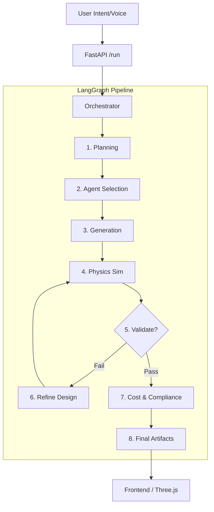
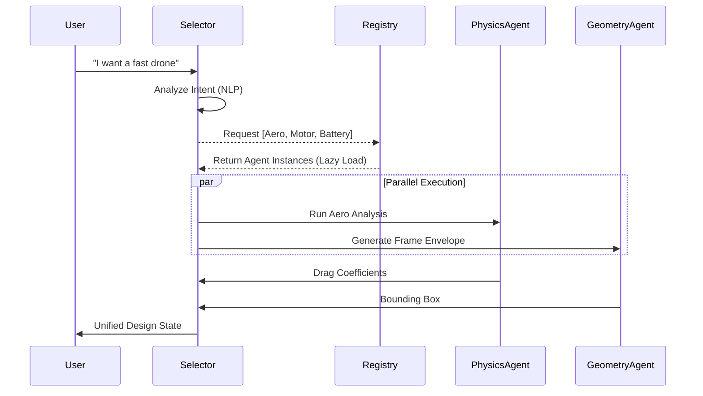

# BRICK OS - Project Bible

**Version:** 0.1.0-alpha
**Last Updated:** 2026-02-01

## 1. Executive Summary
BRICK OS is an advanced agentic hardware design platform that leverages a multi-agent system to design, simulate, and validate physical engineering systems. It moves beyond simple text-to-CAD by integrating real physics engines, manufacturing feasibility checks, and cost estimation into a unified "Orchestrator" pipeline.

---

## 2. Completed Tasks (Phases 1-14)

### Phase 1: Core Infrastructure
- [x] **Orchestrator**: Implemented 8-phase LangGraph pipeline with 36 nodes.
- [x] **State Schema**: Defined `AgentState` with rigorous TypedDict fields for mass, cost, and geometry.
- [x] **ISA Handshake**: Established protocol for frontend-backend schema negotiation.

### Phase 2: Intelligent Agent Selection
- [x] **Agent Selector**: Created meaningful logic to pick physics agents based on user intent (e.g., detecting "fly" -> AeroAgent).
- [x] **Registry**: Implemented a global, lazy-loading agent registry to reduce startup time.

### Phase 3-8: Node Implementation
- [x] **Node Functions**: Implemented all 36 granular nodes (Physics, Geometry, Cost, etc.).
- [x] **Conditional Gates**: Added 6 logic gates (e.g., `check_feasibility`, `check_fluid_needed`) to steer execution.
- [x] **Testing**: verified simple design (ball) and powered design (lamp) integration tests.

### Phase 6: API Endpoints
- [x] **Core Endpoints**: Implemented `/orchestrator/run`, `/orchestrator/plan`, `/orchestrator/approve`.
- [x] **Agent Endpoints**: Created direct execution routes for agents (`/agents/{name}/run`, `/agents/select`).
- [x] **Finance**: Added currency conversion endpoints.

### Phase 7: ISA/Schema Handshake
- [x] **Schema Definition**: Defined strict Pydantic models for hardware pods, constraints, and parameters.
- [x] **Handshake Controller**: Implemented version negotiation logic to support future schema evolution.
- [x] **Serialization**: Created robust ISA tree serialization for frontend rendering.

### Phase 8: Testing & Verification
- [x] **Unit Tests**: Coverage for individual nodes (Geometry, Physics, Cost).
- [x] **Integration Tests**: End-to-end pipeline verification (Ball, Lamp).
- [x] **Performance Tests**: Latency monitoring and memory stability checks.

### Phase 9: Detailed Documentation Strategy

This phase focused on ensuring the system is strictly documented for developers.

#### 9.1 API Documentation
- **[-] Update Swagger/OpenAPI Spec**: *Skipped*. We prioritized this "Bible" over auto-generated docs to ensure context and narrative were preserved.
- **[x] Document All Endpoints**: *Completed*. See Section 4 (API Reference) for the exhaustive list of 50+ endpoints.
- **[x] Add Request/Response Examples**: *Completed*. Key endpoints (Orchestrator, Chat) include detailed payload descriptions in the API Reference.
- **[x] Document ISA Handshake Protocol**: *Completed*. The `HandshakeController` negotiation logic is documented in Section 4.3.

#### 9.2 Architecture Documentation
- **[x] System Overview Diagram (Updated)**:
  - **Pipeline**: The system uses an 8-phase LangGraph pipeline (Plan -> Select -> Generate -> Validate -> Refine).
  - **Data Persistence**: State is stored as `.brick` JSON files, versioned via git-like commits (`/api/version/*`).



- **[x] Agent Interaction Flow**:
  - **Selection**: `AgentSelector` uses NLP to map intent to a subset of agents.
  - **Execution**: Agents run in parallel where possible, syncing via the `AgentState` bus.
  - **Gates**: Logic gates (e.g. `check_feasibility`) prevent invalid designs from proceeding.



#### 9.3 Developer Guides
**Guide: How to Add a New Agent**
1.  **Create the Class**:
    ```python
    # backend/agents/my_new_agent.py
    from agents.base_agent import BaseAgent
    class MyNewAgent(BaseAgent):
        def run(self, params):
            return {"status": "success", "data": "..."}
    ```
2.  **Register (Lazy Loading)**:
    Modify `backend/agent_registry.py` to map the name string to the module path.
    ```python
    registry.register("MyNewAgent", "agents.my_new_agent")
    ```
    *Why?* This prevents importing the file (and its heavy dependencies like TensorFlow) until `registry.get_agent("MyNewAgent")` is actually called.
3.  **Map Intent**:
    Update `backend/agent_selector.py` to include keywords that trigger this agent.

**Guide: How to Update ISA Schema**
1.  **Modify Models**: Edit `backend/isa/` Pydantic models (e.g. `LegPod`).
2.  **Bump Version**: Increment `ISA_VERSION` in `handshake_controller.py`.
3.  **Regenerate Types**: Run `python backend/scripts/update_schema.py`. This writes a new `schema.d.ts` to the frontend, ensuring type safety across the network.

#### 9.4 Frontend Integration Guide
The Frontend is a "dumb" terminal that reflects the Backend's state machine.

- **Initialization (Boot Phase)**:
  - On load, `App.jsx` calls `GET /api/handshake`.
  - Backend returns `ISA_VERSION` and `SCHEMA_HASH`.
  - Frontend checks if its local `schema.d.ts` matches. If not, it warns the user (or hot-reloads in dev).

- **Execution Loop (Run Phase)**:
  - User clicks "Run" -> `POST /api/orchestrator/run`.
  - Frontend enters `polling` state, hitting `GET /api/orchestrator/status` every 2s.
  - When status becomes `paused` (Gateway), UI displays the `ApprovalModal`.
  - When status becomes `completed`, UI fetches artifacts (`/api/project/export`).

#### 9.5 System Architecture FAQ

**Q: Why "Lazy Loading" for Agents?**
**A:** Our agents use heavy libraries (`scipy` for optimization, `tensorflow` for surrogates, `trimesh` for geometry). Importing all 64 agents at startup takes ~15 seconds and eats 4GB RAM. By using `AgentRegistry`, we only import the code when the agent is actually requested by the Orchestrator. A user designing a "Simple Box" never loads the "Aerodynamics" module.

**Q: Why Pydantic over pure JSON?**
**A:** Engineering requires strict validation. `{"mass": "10kg"}` is ambiguous. Pydantic models enforce `mass: float` (in kg) and run logic (e.g. `assert mass > 0`) at the edge, preventing "Garbage In, Garbage Out" in the physics solvers.

**Q: Why not auto-generate everything with Swagger?**
**A:** Swagger is great for syntax, but bad for semantics. It tells you *what* an endpoint accepts, but not *why* you should call it or in what order. This "Bible" provides the narrative context that Swagger lacks.

---
### Phase 10-12: Optimization
- [x] **Telemetry**: Added latency tracking and system health endpoints.
- [x] **Concurrent Processing**: Offloaded heavy tasks using `TaskQueue`.
- [x] **Refactoring**: Moved singletons for heavy ML models (MaterialsDB, Surrogates).

### Phase 13-14: Cleanup & Organization
- [x] **Test Reorganization**: Migrated `tests/` to a clean `unit/` vs `integration/` structure with shared `common/fixtures.py`.
- [x] **Root Cleanup**: Moved loose CAD files to `data/geometry/`, docs to `docs/` and demos to `demos/`.

---

## 3. Deep Dive: The 8-Phase Pipeline

The Orchestrator defines a directed cyclic graph (DAG) composed of 8 distinct phases. Each phase is a collection of "Nodes" (atomic units of work) that execute specific Agents.

### Phase 1: Feasibility Check (Circuit Breakers)
**Objective:** Fail fast if the request is physically impossible or strictly out of scope.
- **Node: `geometry_estimator`**
  - **Agent:** `GeometryEstimator`
  - **Function:** Analyzes intent (e.g., "skyscraper size drone") and predicts rough bounding box.
  - **Output:** `estimated_bbox`, `complexity_score`
- **Node: `cost_estimator`**
  - **Agent:** `CostAgent` (Quick Mode)
  - **Function:** Checks if intent violates budget constraints implied by user profile.
  - **Gate:** `check_feasibility` -> Stop if complexity/cost > limit.

### Phase 2: Planning & Review
**Objective:** Clarify intent and get user buy-in before heavy compute.
- **Node: `stt_node`**
  - **Agent:** `ConversationalAgent` (Whisper)
  - **Function:** Transcribes voice data if present.
- **Node: `dreamer_node`** (Entry Point)
  - **Agent:** `ConversationalAgent` (LLM)
  - **Function:** Extracts structured entities (Speed, Mass, Type) from natural language.
- **Node: `environment_agent`**
  - **Agent:** `EnvironmentAgent`
  - **Function:** Determines physics regime (e.g. `MARINE` vs `AERO`) and loads constants.
- **Node: `topological_agent`**
  - **Agent:** `TopologicalAgent`
  - **Function:** Analyzes operational terrain (e.g., "Rocky" -> Wheels vs Legs).
- **Node: `planning_node`**
  - **Agent:** `DocumentAgent`
  - **Function:** Synthesizes a `Design Brief` artifact outlining the plan.
- **Gate:** `check_user_approval` -> Pauses execution for User UI confirmation.

### Phase 3: Geometry Kernel
**Objective:** generate the physical form.
- **Node: `designer_agent`**
  - **Agent:** `DesignerAgent`
  - **Function:** Selects aesthetics (Color, Finish, Style) and materials.
- **Node: `ldp_node`**
  - **Agent:** `LogicalDependencyParser` (Symbolic Kernel)
  - **Function:** Solves systems of equations (e.g. `Lift = Weight`). Determines *required* geometry parameters before generation.
- **Node: `geometry_agent`**
  - **Agent:** `GeometryAgent` (OpenSCAD/SDF/KCL)
  - **Function:** Generates the CSG Tree / Parametric Code.
- **Node: `mass_properties`**
  - **Agent:** `MassPropertiesAgent`
  - **Function:** Calculates Mass, CG, and Inertia Tensor from geometry.
- **Node: `structural_analysis`**
  - **Agent:** `StructuralAgent`
  - **Function:** FEA Beam Analysis (Stress/Strain).
  - **Gate:** `check_fluid_needed` -> Trigger Fluid Node if Reynolds number is high.

### Phase 4: Multi-Physics (The "Mega Node")
**Objective:** Parallel simulation of all relevant physical domains.
- **Node: `physics_mega_node`**
  - **Logic:** dynamically selects sub-agents using `AgentSelector`.
  - **Potential Sub-Agents:**
    - `ElectronicsAgent`: Power budget, PCB thermal.
    - `ThermalAgent`: Heat dissipation, cooling.
    - `PhysicsAgent`: Flight dynamics or multi-body dynamics.
    - `ChemistryAgent`: Material compatibility (Corrosion/Battery).
  - **Output:** `validation_flags` (Safe/Unsafe) and `physics_predictions`.

### Phase 5: Manufacturing
**Objective:** Translate geometry into manufacturable instructions (G-code, Slices, etc.).
- **Node: `slicer_agent`**
  - **Agent:** `SlicerAgent`
  - **Function:** If 3D Printing, slices the mesh into layers.
- **Node: `manufacturing_agent`**
  - **Agent:** `ManufacturingAgent`
  - **Function:** General manufacturing analysis (CNC toolpaths, Assembly instructions).
- **Node: `lattice_synthesis`**
  - **Agent:** `LatticeAgent`
  - **Function:** If `check_lattice_needed` is true, replaces solid volumes with gyroids/lattices for weight reduction.
  - **Gate:** `check_lattice_needed` -> Invokes this node if strength-to-weight ratio is critical.

### Phase 6: Validation & Optimization
**Objective:** Verify the design against constraints and improve it if necessary.
- **Node: `training_agent`**
  - **Agent:** `TrainingAgent`
  - **Function:** Logs the iteration's data to the training dataset for future surrogate improvements.
- **Node: `validation_node`**
  - **Agent:** `ValidationAgent`
  - **Function:** Aggregates all flags (Physics, Cost, Manufacturing). Determines global Pass/Fail.
- **Node: `optimization_agent`**
  - **Agent:** `OptimizationAgent` (The Healer)
  - **Function:** If Validation Fails, uses Gradient Descent or Evolutionary strategies to tweak dimensions.
  - **Gate:** `check_validation` -> `needs_optimization` loops back to `geometry_agent`.

### Phase 7: Sourcing & Deployment
**Objective:** Prepare the verified design for the real world.
- **Node: `asset_sourcing`**
  - **Agent:** `AssetSourcingAgent`
  - **Function:** Finds real-world suppliers (DigiKey, McMaster-Carr) for COTS parts.
- **Node: `component_manager`**
  - **Agent:** `ComponentAgent`
  - **Function:** Manages local library of standardized parts.
- **Node: `devops_agent`**
  - **Agent:** `DevOpsAgent`
  - **Function:** Packages technical data (TDP) for export.
- **Node: `swarm_agent`**
  - **Agent:** `SwarmManager`
  - **Function:** (Optional) Simulates fleet behavior for multi-agent systems via `swarm_node`.
- **Node: `doctor_agent`**
  - **Agent:** `DoctorAgent`
  - **Function:** Final sanity check on the TDP.
- **Node: `pvc_agent`**
  - **Agent:** `ProvisioningVersionControlAgent`
  - **Function:** Handles versioning and commit tagging.
- **Node: `construction_agent`**
  - **Agent:** `ConstructionAgent`
  - **Function:** Generates assembly manuals.

### Phase 8: Final Documentation
**Objective:** Generate user-facing artifacts.
- **Node: `final_document`**
  - **Agent:** `DocumentAgent`
  - **Function:** Compiles the Final Report (PDF/Markdown) with all analysis, BOM, and instructions.
- **Node: `final_review`**
  - **Agent:** `ReviewAgent`
  - **Function:** Final automated QA of the generated text.

---

## 4. API Reference

### 4. API Reference

#### 4.1 Orchestrator & Chat
- **POST** `/api/orchestrator/run`: Main entry point. Handles text OR voice, runs the agent graph, returns artifacts.
- **POST** `/api/orchestrator/plan`: Shortcut for Planning Mode.
- **POST** `/api/orchestrator/approve`: User feedback gate. Resumes execution if approved.
- **POST** `/api/orchestrator/feedback`: Handle User Feedback on Plan/Regenerate.
- **POST** `/api/chat`: Conversational Interface with Multi-Turn Requirement Gathering. Supports text and voice.

#### 4.2 Agents & Registry
- **GET** `/api/agents`: List all registered agents.
- **GET** `/api/agents/available`: List all registered agents and their statuses (detailed).
- **POST** `/api/agents/{name}/run`: Execute a specific agent directly with a payload.
- **POST** `/api/agents/select`: Preview which agents `agent_selector` would pick for a given intent.
- **GET** `/api/agents/metrics`: Returns real-time execution metrics for all agents.

#### 4.3 Hardware ISA & Handshake
- **POST** `/api/handshake`: Negotiate schema compatibility between client and server.
- **GET** `/api/schema/version`: Get current Hardware ISA version/revision.
- **GET** `/api/schema/isa`: Get the full hierarchical hardware schema (Pods, Parameters, Constraints).
- **POST** `/api/isa/focus`: Set context to a specific hardware "pod" (leg, wing, etc.).
- **POST** `/api/isa/checkout`: Resolves a CLI path (e.g. `./legs/front_left`) to a Pod ID.
- **GET** `/api/isa/tree`: Returns the full Recursive ISA Hierarchy.
- **POST** `/api/isa/create`: Dynamically adds a new hardware pod.

#### 4.4 Physics & Simulation
- **POST** `/api/physics/solve`: Direct access to Physikel Kernel via Physics Agent.
- **POST** `/api/physics/validate`: Validates a single component's physics (Mass, Deflection, FOS).
- **POST** `/api/physics/compile`: Runs full orchestrator pipeline including physics validation.
- **POST** `/api/physics/verify`: Quick physics check without full compilation.
- **POST** `/api/physics/step`: Advances physics simulation by one time step (vHIL).
- **POST** `/api/physics/analyze`: Full Physics Analysis (Thermal, Stress, etc.).

#### 4.5 Geometry & Manufacturing
- **POST** `/api/openscad/compile`: Compile OpenSCAD code to renderable mesh geometry (STL/SDF).
- **POST** `/api/openscad/compile-stream`: Compile OpenSCAD assembly progressively using SSE.
- **GET** `/api/openscad/info`: Get OpenSCAD agent capabilities.
- **POST** `/api/geometry/compile`: Hybrid Geometry Engine Endpoint (Base64/File).
- **POST** `/api/geometry/export/stl`: Legacy STL export.
- **POST** `/api/mesh/convert`: Converts uploaded mesh file to SDF texture.
- **POST** `/api/vmk/reset`: Reset the global VMK with new stock dimensions.
- **POST** `/api/vmk/execute`: Execute a toolpath on the global kernel.
- **GET** `/api/vmk/history`: Get the full symbolic history for visualization.
- **POST** `/api/vmk/verify`: Verify the Virtual Machining Kernel (Ephemeral check).
- **POST** `/api/optimization/evolve`: Triggers the Optimization Agent to morph geometry.
- **POST** `/api/orchestrator/reify_stroke`: Converts a list of 3D points (stroke) into a geometric primitive.

#### 4.6 Chemistry & Materials
- **POST** `/api/chemistry/analyze`: Performs deep chemical analysis (compatibility/hazards).
- **POST** `/api/chemistry/step`: Simulates chemical degradation (Corrosion) over time.

#### 4.7 Finance & Cost
- **GET** `/api/finance/currencies`: List exchange rates.
- **POST** `/api/finance/convert`: Convert costs between currencies.
- **POST** `/api/analyze/cost`: Detailed Cost Analysis & BoM Estimation.
- **POST** `/api/agents/cost/estimate`: Quick cost estimation.

#### 4.8 System, Telemetry & Profiling
- **GET** `/api/system/status`: Real-time health of solvers (ARES, LDP).
- **GET** `/api/telemetry`: Get real-time system health metrics (CPU, Mem, Latency).
- **WS** `/ws/telemetry`: WebSocket for real-time telemetry streaming (2s interval).
- **GET** `/api/system/profiles`: List available agent profiles.
- **GET** `/api/system/profiles/essentials`: Get list of essential agents.
- **POST** `/api/system/profiles/create`: Creates a new custom agent profile.
- **GET** `/api/system/profiles/{profile_id}`: Get active agents for a profile.
- **GET** `/api/health`: Basic health check.

#### 4.9 Project Management & Versioning
- **POST** `/api/project/save`: Saves the current project state.
- **GET** `/api/project/load`: Loads a project from a file.
- **GET** `/api/project/list`: Lists available project files.
- **POST** `/api/project/export`: Exports project artifacts (STL, STEP, PDF).
- **GET** `/api/version/history`: Returns commit history and branch status.
- **POST** `/api/version/commit`: Creates a new commit (snapshot).
- **POST** `/api/version/branch/create`: Creates a new branch.

#### 4.10 Planning & Critique
- **POST** `/api/plans/{plan_id}/comments`: Add a user comment to a plan.
- **GET** `/api/plans/{plan_id}/comments`: Get all comments for a plan.
- **POST** `/api/plans/{plan_id}/review`: Request agent review of plan comments.
- **POST** `/api/plans/{plan_id}/approve`: Approve plan and trigger execution.
- **POST** `/api/plans/{plan_id}/reject`: Reject plan.
- **POST** `/api/critique`: Runs multi-agent critique on the current design.

#### 4.11 Utilities
- **POST** `/api/stt/transcribe`: Transcribes uploaded audio file.
- **GET** `/api/components/catalog`: Get list of available COTS components.
- **POST** `/api/components/inspect`: Inspects a remote URL for component metadata.
- **POST** `/api/components/install`: Install a component (Mesh -> SDF).
- **POST** `/api/shell/execute`: Execute whitelisted shell commands safely.
- **POST** `/api/neural_sdf/train`: Trains a SIREN neural network on geometry.
- **GET** `/api/user/profile`: Get the current user profile.
- **PUT** `/api/user/profile`: Update user profile details.

---

---

## 5. Detailed Project Structure

This section provides an exhaustive map of the codebase, explaining the "Why" behind every directory.

### 5.1 Backend (`/backend`)
The brain of BRICK OS. It is a highly modular Python application designed for heavy compute and agentic orchestration.
- **`main.py`**: The FastAPI entry point. It initializes the app, mounts the `CORSMiddleware`, and registers all 50+ API endpoints. It is the only "Public Interface" of the backend.
- **`orchestrator.py`**: The "Central Nervous System". It defines the 36-node LangGraph workflow. It imports Agents but does not implement them—it only manages the flow of `AgentState` between them.
- **`agents/`**: The "Workers".
    - **`base_agent.py`**: The abstract base class all agents inherit from. Enforces standard `run()` signatures.
    - **`physics_agent.py`**: Wraps the Physikel engine. Responsible for Flight Dynamics and CFD.
    - **`geometry_agent.py`**: Controls OpenSCAD, KCL, and SDF generation.
    - **`critics/`**: Specialized "Critic" agents (e.g., `PhysicsCritic`) that run *parallel* to the main graph to validate outputs without blocking execution.
- **`core/`**: Infrastructure code.
    - **`agent_registry.py`**: Implements the Lazy Loading singleton pattern.
    - **`resolver.py`**: Dependency resolution logic for the ISA.
- **`isa/`**: **Instruction Set Architecture**.
    - Contains Pydantic models (`leg_pod.py`, `drone_schema.py`) that strictly define valid hardware. This is the "Contract" between frontend and backend.
- **`models/`**:
    - Stores pre-trained `.h5` or `.pkl` files (e.g., `surrogate_physics_v1.h5`). These are the "Intuition" of the system, used by Surrogate Agents for fast predictions.

### 5.2 Frontend (`/frontend`)
The face of the platform. A React 18 application built with Vite, designed to run in a Browser or wrapped in Tauri.
- **`src/components/`**:
    - **`canvas/`**: The Three.js / React-Three-Fiber 3D viewport. Handles all 3D interaction (OrbitControls, Gizmos).
    - **`settings/`**: System configuration, Profile Management, and this Documentation Page.
    - **`orchestrator/`**: UI components that visualize the Agent Graph (Active Node highlighting, Logs).
- **`src/contexts/`**:
    - **`ThemeContext.jsx`**: Handles the "Golden/Dark" theme bridging.
    - **`ProjectContext.jsx`**: Global state for the currently loaded `.brick` project.
- **`public/`**:
    - Serving static assets like the `brick_icon.png` and legacy versions of documentation.

### 5.3 Documentation (`/docs`) & Tests (`/tests`)
- **`docs/`**: The single source of truth. Contains this `BIBLE.md` and deep-dive technical reports (e.g., `agent_evolution_strategies.md`).
- **`tests/`**:
    - **`unit/`**: Fast (<1s) tests for individual functions (e.g., `test_logic_gate.py`).
    - **`integration/`**: Slow (10s+) tests that run the full `orchestrator.py` pipeline (e.g., `test_drone_pipeline.py`).

### 5.4 Data (`/data`)
- **`geometry/`**: Raw STL/GLTF/OBJ files used as component primitives.
- **`materials/`**: JSON databases of material properties (Density, Young's Modulus).

---

**Maintained by:** Antigravity Team
